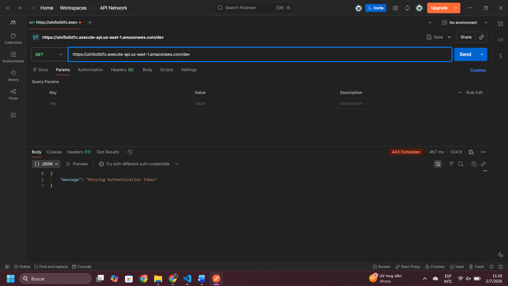
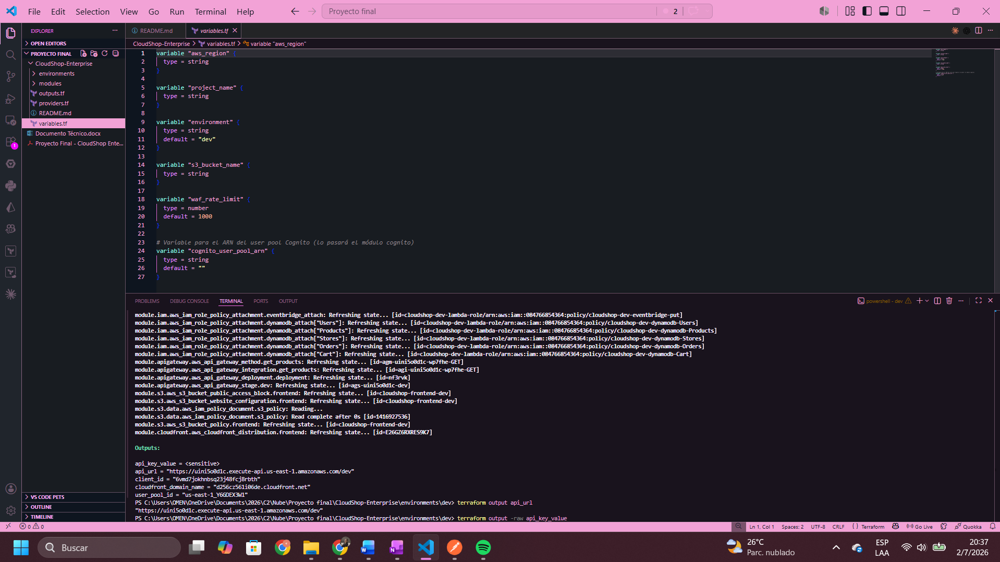

## Evidencias de los casos de prueba

### Caso 1 – Intento de acceso sin permisos (403 Forbidden)

Se realizó una petición `GET /v1/products` con la API Key correcta pero **sin el token JWT de Cognito**. El API Gateway respondió con `403 Forbidden`, demostrando que la autenticación está correctamente configurada.



---

### Caso 4 – Despliegue completo mediante Terraform

Se ejecutó `terraform apply` desde cero, creando todos los recursos definidos en el código (S3, CloudFront, WAF, API Gateway, IAM, Cognito). Terraform completó el despliegue exitosamente.`



---

## Despliegue

### Variables (`environments/dev/terraform.tfvars`)

Copia `environments/dev/terraform.tfvars.example` a `environments/dev/terraform.tfvars` y completa los valores reales (ver comentarios en el archivo).

### Backend remoto (una sola vez, antes del primer `apply` de `environments/dev`)

```
cd environments/backend-bootstrap
terraform init
terraform apply
```

Crea el bucket S3 (state) y la tabla DynamoDB (lock) que usa `environments/dev/backend.tf`. Solo se corre una vez por cuenta/equipo, no en cada deploy.

### Stack principal

```
cd environments/dev
terraform init
terraform plan -out=tfplan.out
terraform apply tfplan.out
```

El frontend (carpeta `frontend/`) se sube automáticamente al bucket S3 como parte de este mismo `apply` (un recurso `aws_s3_object` por archivo, en `environments/dev/main.tf`) — no hace falta ningún `aws s3 sync` manual.

### Despues del apply: conectar el frontend a la API real

`frontend/config.js` trae valores de ejemplo. Despues del primer `apply`, actualiza ese archivo con los valores reales:

```
terraform output api_url            # -> API_BASE_URL
terraform output api_key_value      # -> API_KEY (opcional, ver comentario en config.js)
```

Como `config.js` es uno de los archivos que sube `aws_s3_object`, despues de editarlo hay que volver a correr `terraform apply` (o subirlo a mano con `aws s3 cp frontend/config.js s3://<bucket>/config.js`) para que el bucket refleje el cambio. La URL publica del sitio es el dominio de CloudFront: `terraform output cloudfront_domain_name`.